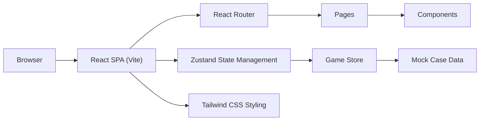

## 1. 架构设计

本项目为纯前端单页应用，采用 React + TypeScript + Vite 技术栈，所有数据为本地 mock 数据，无需后端服务。



## 2. 技术描述

- **前端框架**: React 18 + TypeScript
- **构建工具**: Vite 5
- **路由管理**: React Router DOM 6
- **状态管理**: Zustand
- **样式方案**: Tailwind CSS 3
- **图标库**: Lucide React
- **后端**: 无（纯前端应用）
- **数据库**: 无（本地 mock 数据，localStorage 存储进度）

## 3. 路由定义

| 路由路径 | 页面组件 | 功能描述 |
|----------|----------|----------|
| `/` | `HomePage` | 首页，展示游戏介绍和关卡列表 |
| `/case/:id` | `CasePage` | 病例关卡页面，进行咬合评估训练 |
| `/result/:id` | `ResultPage` | 评分讲评页面，展示得分和标准摘要 |

## 4. 数据模型

### 4.1 病例数据模型

```typescript
interface CaseData {
  id: number;
  title: string;
  difficulty: "easy" | "medium" | "hard";
  patientInfo: {
    age: string;
    gender: string;
    occupation: string;
  };
  chiefComplaint: string;
  intraoralDescription: string;
  occlusalClues: string[];
  correctSequence: string[]; // 正确的检查顺序
  requiredFindings: Finding[]; // 需要识别的征象
  dialoguePrompts: DialoguePrompt[]; // 问诊提示
  standardSummary: string; // 标准评估摘要
}

interface Finding {
  id: string;
  name: string;
  category: "earlyContact" | "deepOverbite" | "crossBite" | "unilateralChewing" | "other";
  description: string;
  points: number; // 该征象的分值
}

interface DialoguePrompt {
  trigger: string; // 触发条件
  text: string; // 问诊话术
}

interface UserProgress {
  caseId: number;
  score: number;
  completed: boolean;
  attempts: number;
}
```

### 4.2 游戏状态模型

```typescript
interface GameState {
  currentStep: number; // 当前步骤
  selectedSequence: string[]; // 用户选择的检查顺序
  selectedFindings: string[]; // 用户选择的征象
  feedbackHistory: FeedbackItem[]; // 反馈历史
  score: number;
  deductions: DeductionItem[]; // 扣分明细
}

interface FeedbackItem {
  step: number;
  correct: boolean;
  message: string;
  dialoguePrompt?: string;
}

interface DeductionItem {
  reason: string;
  points: number;
  correctAction: string;
}
```

## 5. 项目目录结构

```
src/
├── components/           # 可复用组件
│   ├── CaseCard.tsx      # 病例卡片组件
│   ├── OperationButton.tsx # 操作按钮组件
│   ├── FeedbackModal.tsx # 反馈弹窗组件
│   ├── FindingCard.tsx   # 征象选择卡片
│   ├── ScoreRing.tsx     # 得分环形图
│   └── DeductionList.tsx # 扣分明细列表
├── pages/                # 页面组件
│   ├── HomePage.tsx      # 首页
│   ├── CasePage.tsx      # 病例关卡页
│   └── ResultPage.tsx    # 评分讲评页
├── data/                 # Mock 数据
│   └── cases.ts          # 病例数据
├── store/                # 状态管理
│   └── useGameStore.ts   # 游戏状态 store
├── types/                # TypeScript 类型定义
│   └── index.ts          # 类型定义文件
├── utils/                # 工具函数
│   └── scoring.ts        # 评分计算工具
├── App.tsx               # 应用根组件
├── main.tsx              # 应用入口
└── index.css             # 全局样式
```

## 6. 核心功能实现要点

### 6.1 检查顺序验证逻辑

- 第一步必须选择"正中咬合检查"，否则立即扣分并提示
- 正中咬合检查完成后，才能进行"前伸运动检查"或"侧方运动检查"
- 根据病例特点，前伸和侧方检查的顺序可能有要求

### 6.2 征象判断逻辑

- 提供多选卡片，用户选择认为需要记录的征象
- 系统对比用户选择与正确答案
- 漏选扣分，错选额外扣分
- 即时反馈遗漏的征象和问诊提示

### 6.3 评分规则

- 总分 100 分
- 检查顺序正确：40 分（每步错误扣相应分数）
- 征象识别正确：60 分（漏选/错选扣分）
- 每关完成后显示得分和等级（优秀≥90，良好≥75，及格≥60，不及格<60）

### 6.4 数据持久化

- 使用 localStorage 存储用户进度（完成状态、得分）
- 刷新页面后进度不丢失
- 提供"重置进度"功能
