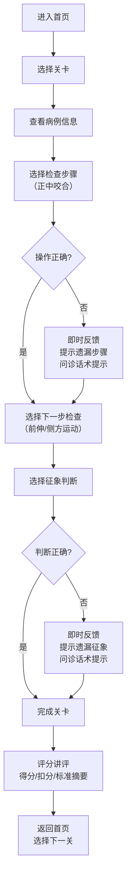

## 1. 产品概述

面向口腔医学生和新入职医生的全口咬合关系评估训练小游戏，通过病例闯关方式练习检查顺序和判断表达，帮助初学者熟练掌握全口咬合关系评估流程。

- 核心目标：让学员通过交互式训练掌握正确的咬合评估检查顺序，准确识别早接触、深覆合、反合、偏侧咀嚼等异常征象
- 目标用户：口腔医学生、新入职口腔医生、诊所培训晨会、学校实训课
- 产品价值：标准化培训工具，降低带教成本，提高学习效率和评估准确性

## 2. 核心功能

### 2.1 用户角色

| 角色 | 注册方式 | 核心权限 |
|------|----------|----------|
| 学员用户 | 无需注册，直接使用 | 浏览病例关卡、进行操作练习、查看评分讲评 |

### 2.2 功能模块

1. **首页/关卡选择**：游戏介绍、关卡列表、进度展示
2. **病例关卡页面**：患者信息展示、操作选择区、即时反馈区
3. **评分讲评页面**：得分展示、扣分原因、标准评估摘要

### 2.3 页面详情

| 页面名称 | 模块名称 | 功能描述 |
|----------|----------|----------|
| 首页 | 关卡列表 | 展示所有病例关卡，显示完成状态和得分 |
| 首页 | 游戏说明 | 介绍游戏规则、评分标准、学习目标 |
| 病例关卡 | 病例信息 | 展示患者主诉、口内照片文字描述、咬合线索 |
| 病例关卡 | 操作选择区 | 提供检查顺序选项（正中咬合→前伸/侧方运动）和征象判断选项 |
| 病例关卡 | 即时反馈 | 操作后立即显示是否遗漏步骤，给出诊室语言提示 |
| 病例关卡 | 对话提示 | 显示下一句该如何询问患者的建议话术 |
| 评分讲评 | 得分展示 | 显示本关得分、扣分明细 |
| 评分讲评 | 标准摘要 | 展示该病例的标准评估摘要 |
| 评分讲评 | 讲评说明 | 解释扣分原因和正确做法 |

## 3. 核心流程

用户进入首页选择关卡 → 查看病例信息（主诉、口内描述、咬合线索）→ 选择第一步检查（正中咬合）→ 系统判断是否正确，给出反馈 → 选择下一步检查（前伸/侧方运动）→ 选择需要记录的征象（早接触、深覆合、反合、偏侧咀嚼）→ 系统即时反馈遗漏点和问诊提示 → 完成所有操作后进入评分讲评 → 查看得分、扣分原因和标准评估摘要 → 返回首页选择下一关

## 4. 用户界面设计

### 4.1 设计风格

- **设计定位**：专业医学教育风格，简洁清晰，突出内容可读性和操作引导性
- **主色调**：医疗蓝（#165DFF）作为主色，代表专业、信任
- **辅助色**：薄荷绿（#36D399）表示正确，珊瑚红（#F87272）表示错误，琥珀黄（#FBBF24）表示提示
- **中性色**：浅灰背景（#F8FAFC），深灰文字（#1E293B），保证良好的阅读对比度
- **按钮风格**：圆角卡片式按钮，悬停有轻微上浮阴影，点击有按压效果
- **字体**：使用 Noto Sans SC 中文显示字体，标题加粗，正文适中，医疗术语清晰可辨
- **布局风格**：卡片式布局，清晰的信息层级，左侧病例信息，右侧操作区
- **图标风格**：使用线性医疗图标（牙齿、检查工具、对话气泡等），保持专业简洁

### 4.2 页面设计概述

| 页面名称 | 模块名称 | UI 元素 |
|----------|----------|----------|
| 首页 | 关卡列表 | 卡片式关卡展示，包含关卡编号、病例名称、完成状态徽章、得分标签、悬停动画 |
| 首页 | 游戏说明 | 顶部横幅介绍，学习目标列表，评分规则说明卡片 |
| 病例关卡 | 病例信息区 | 左侧固定面板，患者信息卡片，主诉、口内描述、咬合线索分块展示 |
| 病例关卡 | 操作选择区 | 右侧操作面板，检查步骤按钮组，征象判断多选卡片，确认按钮 |
| 病例关卡 | 即时反馈区 | 操作后弹出提示框，正确/错误图标，文字说明，问诊话术气泡 |
| 评分讲评 | 得分面板 | 大号分数展示，环形进度条，扣分明细列表 |
| 评分讲评 | 标准摘要 | 卡片式展示，医生口吻的标准评估报告 |
| 评分讲评 | 讲评说明 | 逐条解释扣分点，配合正确做法指导 |

### 4.3 响应式

- 采用桌面优先设计，针对 1280px 及以上屏幕优化
- 平板端（768-1279px）：左右布局调整为上下布局，操作区宽度自适应
- 移动端（<768px）：单列流式布局，按钮尺寸增大，适合触控操作
- 所有交互元素最小尺寸 44x44px，确保触控友好

## 5. 内容规划

### 5.1 病例关卡设计（共 5 关，难度递进）

| 关卡编号 | 病例名称 | 核心学习点 | 主要征象 |
|----------|----------|------------|----------|
| 第1关 | 深覆合伴早接触 | 正中咬合检查顺序、早接触识别 | 深覆合Ⅲ度、11牙舌侧早接触 |
| 第2关 | 单侧反合 | 侧方运动检查、反合判断 | 左侧后牙反合、偏侧咀嚼习惯 |
| 第3关 | 前伸咬合干扰 | 前伸运动检查、前伸干扰识别 | 前伸咬合时22-42早接触 |
| 第4关 | 复杂咬合异常 | 综合检查流程、多征象判断 | 深覆合、反合、多处早接触 |
| 第5关 | 偏侧咀嚼综合病例 | 问诊技巧、综合评估能力 | 偏侧咀嚼习惯、颞下颌关节不适、咬合不对称 |
